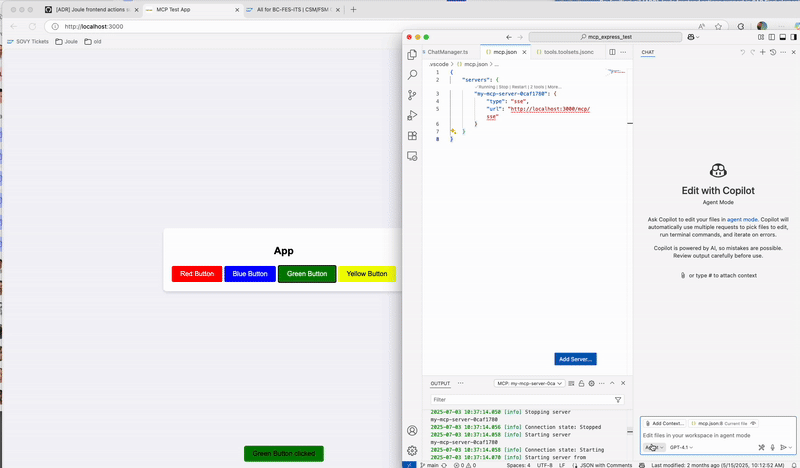

# MCP Express App Test

This app demonstrates how an app can be controlled via the MCP protocol. The example is a little bit artificial as for the current example it would be far easier to just use plain function calling tools.
https://platform.openai.com/docs/guides/function-calling


## How to run it locally

- Download this repo
- Download and install [nodejs](https://nodejs.org)
- Download and install [Ollama](https://ollama.com)
- Start Ollama and run the GWEN3 model: `ollama run qwen3:latest` or `ollama pull qwen3:4b`
- install all dependencies using `npm install`
- start the app using `npm start`
- Open your browser and access [localhost:3000](http://localhost:3000)
- Enter a command like `press blue button` or `presiona el botón azul`

## Integrate it with the Github Copilot Extension in VSCode

Instead of controlling the app via the Ollama GWEN3 based local LLM and chat you can also control it via the Github Copilot Extension of VSCode. The Copilot Extension now supports MCP servers. You can just create a new file called `mcp.json` in the folder `.vscode/` and declare the MCP server there.

```json
{
  "servers": {
    "test-app-ui-conrol-mcp-server": {
      "type": "sse",
      "url": "http://localhost:3000/mcp/sse"
    }
  }
}
```

Afterwards you should be able to control the app using commands like `press green button`, `press yellow button` etc.

Here is a screen recording of how this looks like:


> You need a Github Copilot subscription to be able to use Copilot

> If the tool is not available in the Github Copilot VSCode extension your organization might have restricted the use of MCP servers. You can bypass this restriction by starting VSCode offline, so by disabling your network/wifi connection before your start VSCode. Once VSCode has been started you enable your network connection again as the organization restrictions are just checked once upon startup of VSCode.

## Acknowledgements

This project is a fork of the [mcp-express-app](https://github.com/cgrail/mcp_express_test) developed by [cgrail](https://github.com/cgrail). He shared it to me in a discussion on the future of app development with LLMs and MCP.
